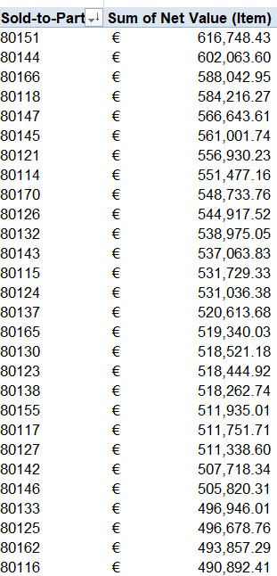
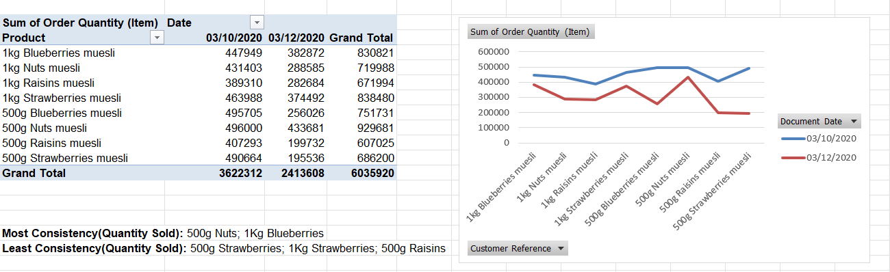

# 📊 Project 3: Business Analytics Case Study — Sales, Revenue & Product Insights (Excel)

This project analyzes customer purchasing behavior, product performance, and revenue consistency using Excel.  
It includes **raw data**, **cleaned data**, and **six pivot tables** that answer key business questions.  
The goal is to demonstrate practical skills in **data cleaning**, **pivot table modeling**, and **business insight generation**.

---

## 📁 Dataset Overview

Two versions of the dataset are included:

- [**Download the Raw Data (Excel)**](./Case_Study_Raw_Data.xlsx)
- [**Download the Cleaned Data and Pivot Tables (Excel)**](./Business%20Analytics%20Case%20Study-Product%20Sales%20Insights.xlsx)

---

## 🧼 Data Cleaning Steps

The cleaned dataset includes:

- Removed duplicate rows  
- Standardized product naming conventions  
- Converted Qty, Price, and Net Value to numeric  
- Removed blank or corrupted entries  
- Ensured dates were in proper date format  
- Verified product groupings (500g vs 1kg, flavor categories)  

This ensures accurate pivot table calculations.

---

# 📈 Pivot Table Analysis

Below are the six pivot tables included in this project, each answering a specific business question.

---

## 1️⃣ Most Purchases by Quantity (Top Customers)

**Pivot Table:**  

---

## 2️⃣ Most Customer Revenue (Top Revenue Customers)

**Pivot Table:**  

---

## 3️⃣ Product Quantity Sold (Top‑Selling Products)

**Pivot Table:**  

---

## 4️⃣ Product Revenue (Highest‑Earning Products)

**Pivot Table:**  

---

## 5️⃣ Sales Quantity Consistency (Across Dates)

**Pivot Table:**  

---

## 6️⃣ Product Revenue Consistency (Across Dates)

**Pivot Table:**  

---

# 🧠 Key Insights

- A small number of customers drive a large share of total revenue.  
- 500g Nuts and 1kg Blueberries are consistently strong performers across both quantity and revenue.  
- Raisins products underperform relative to other products.  
- Revenue and quantity patterns vary significantly across dates, revealing demand volatility.  
- Product size (500g vs 1kg) plays a major role in both sales volume and revenue.  

---
